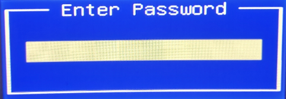

author: Pablo Crespo Cervantes
summary: Resumen del CodeLab 
id: web 
categories: codelab,markdown 
environments: Web 
status: Published 

# Protección de la BIOS/UEFI

En este documento veremos un caso real donde veremos como securizar la BIOS/UEFI para evitar accesos no deseados en esta.

## Introducción

  Primero debemos saber que es una BIOS, esto es un software que se ejecuta en el inicio del arranque del equipo y que inicia y verifica todos los dispositivos que tiene nuestro equipo. Podemos diferenciar entre BIOS UEFI y Legacy, nosotros para este documento utilizaremos una bios UEFI.
  
## Contraseñas en BIOS

Dentro de la BIOS podemos encontrar dos tipos de contraseñas, la de usuario la cual se nos pedira cuando iniciemos el equipo antes de que cargue el SO y la de administrador la cual nos pediran para acceder a la configuración de esta.

### Contraseña de usuario

La primera que configuraremos sera la de usuario ya que es la mas prohibitiba ya que nos pedira la contraseña tanto al iniciar el equipo como al querer acceder a la bios.

Accedemos al menu que hemos visto el cual se encuentra en las opciones avanzadas/security y configuramos la contraseña, minimo tendra que tener 3 caracteres y maximo 20, estos valores no son modificable.

una vez configurada la siguiente vez que iniciemos el equipo se nos mostrara el siguiente cuadro pidiendo la contraseña.

### Contraseña de administrador

Si queremos que el usuario tenga que ingresar la contraseña para iniciar el equiop pero que no pueda acceder a la configuracion de bios podemos configurar una contraseña extra de administrador para que pida esta cuando quiera acceder a la bios.

Volvemos al mismo menu que vimos anteriormente y esta vez configuramos la contraseña de administrador deberia de quedarnos tal como vemos a continuación.

Cuando queramos acceder a la configuración de BIOS nos saldra de nuevo el cuadro de texto solicitando la contraseña de administrador en vez de la de usuario.

## Arranque externos

Para prohibir los arranques externos podemos utilizar la funcion que trae la placa base de capturar el "interrupt 19"

Para entender un poco mas esto se encarga de bloquear la información donde tiene localizado el sector de arranque del disco fisico por lo que impedira que arranque, cabe destacar que esta funcion se apoya en el secure boot y fast boost por loq ue teniendo ambas desactivadas esta opción no funcionara.

## Orden de Arranque

Una de las cosas que debemos de configurar lo mejor que podamos es el orden de arranque en BIOS debido a que cuando queremos configurar un equipo de 0 podemos cambiar este valor poniendo por ejemplo el pendrive de instalación el primero en el orden de arranque teniendo preferencia sobre el disco duro.

Para solucionar esto debemos de confirmar que tenemos en el orden de arranque en primer lugar el disco duro interno, ademas para facilitarnos esta labor podemos eliminar la información de boot dejando solo el dispositivo con el que queremos bootear.

## Otras opciones de seguridad

Aparte de las opciones que hemos vistos podemos tomar otras medidas de seguridad para evitar posibles ataques a nuestro equipo.

### Eliminar power on PCI-E

Un ataque que podemos evitar es que nos enciendan el ordenador a traves de la WAN evitando posibles ataques a nuestro equipo para ello podemos desactivar esta opción, podemos dejar habilitado power on LAN en caso de que en la bios vengan por separado.

### Encriptación TPM

En los ultimos modelos de placa base tenemos un nuevo chip conocido como TPM o modulo de de plataforma de confianza. Este chip se encarga de proteger las claves de cifrado de Windows aunque algunas distribuciones Linux tambien empiezan a usarlo.

Como extra algunas BIOS nos permiten configurar el tipo de encriptación pudiendo pasar de SHA-1 a SHA-256 y adaptar este a su version TPM2

